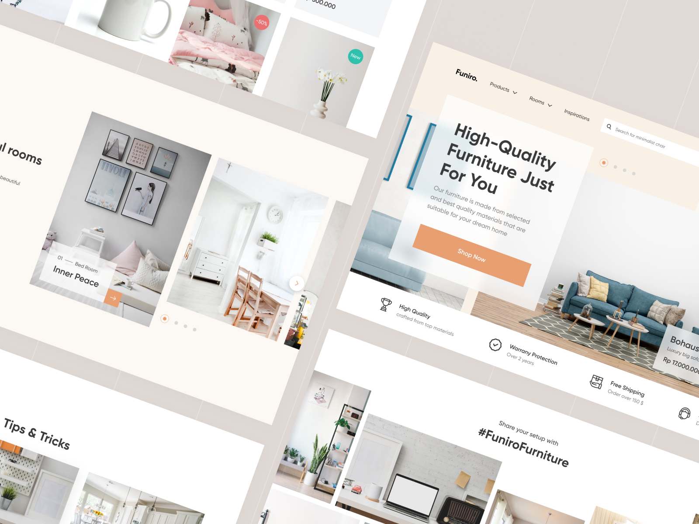

# Furniture Store

I denne opgave skal du arbejde med et færdigt design fra Figma, React og Tailwind.

Designet skal kodes i React med Tailwind. Du må også gerne gøre brug af Emotion og andre bibliotker til fx karuseller, billedgallerier og lignende.

Formålet er at blive bedre til at bruge og huske de forskellige Tailwind klasse-navne. Du skal derfor primært bruge Tailwind til at løse alle styling- og opsætningsudfordringerne i opgaven. Kan du ikke se dig selv ud af en løsning, så prøv først at google ddig frem til en løsning. Som sidste udvej kan du bruge Emotion/CSS-in-JS til at komme i mål.

Designet ligger i en Figma fil som du skal importere til dit eget Figma workspace.

Lidt nede på siden er der et galleri med flere billeder som står lidt hulter-til-bulter. Du må ikke nøjes med at eksportere alle de billeder sammen som et billede. De skal eksporteres og opsættes individuelt.

## Ekstra-opgave

Hvis du hr været hurtig, kan du brug mere tid på at lave websitet responsivt, så det ser godt ud på både mobil og PC skærm.

### Tips

Du kan me fordel bruge lidt tid i starten på at inddele designet i komponenter, evt. med papir og blyant. Derefter laven prioriteret liste over hvilke ting du vil bruge tid på først og følg denne liste.